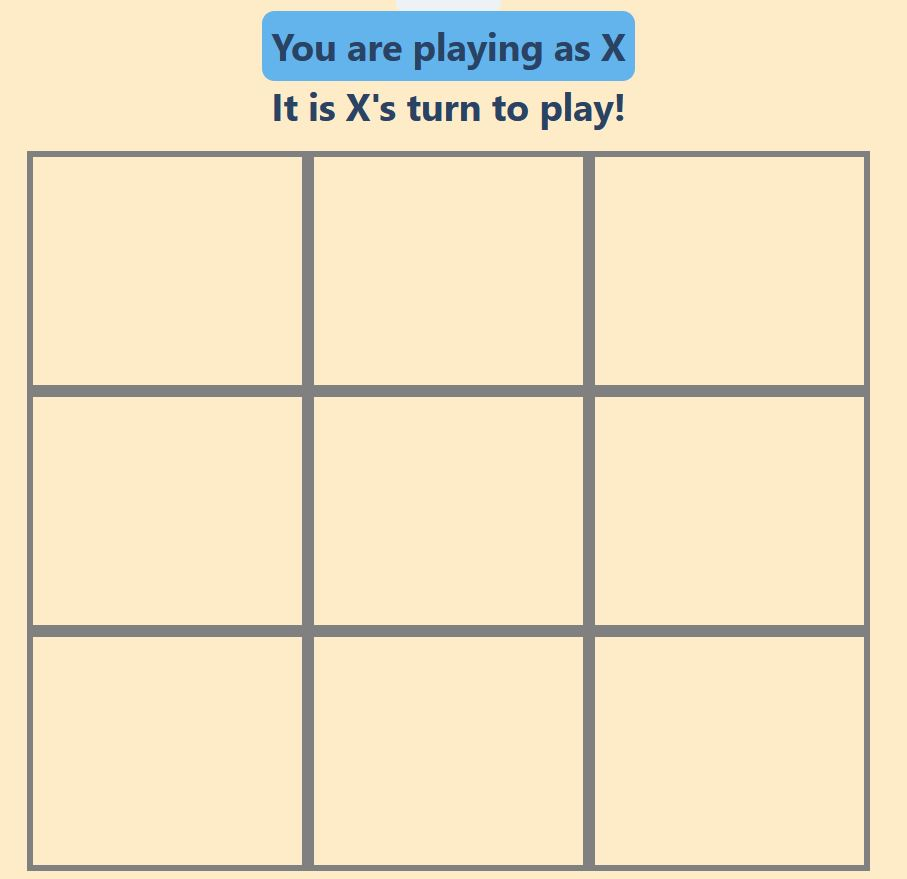

# Tic-Tac-Toe

## Description

The application is your classic Tic-Tac-Toe game. With the ability to play aganist a computer that will try to win and block you from doing so. The application also has an online option where you can create and/or join a room with another player to play. 

Next.js is server side rended framework. So we replaced the built-in server with express in order to be able to run socket.io

I built this app using [Next.js](https://nextjs.org/) framework and [Chakra UI](https://chakra-ui.com/) for the front-end with [Express](https://expressjs.com/) and [Socket.io](https://socket.io/) on the back-end.

## Usage

In order to run the game from the command line use: 
>`npm run dev`

This will start the server which in turn will call the Next code. No need to run either the server or client side seperately.

[Or visit the hosted version on heroku: ](https://tic-tac-toe-nextjs.herokuapp.com/)
`https://tic-tac-toe-nextjs.herokuapp.com/`

## The Game

## Future additions

I look forward to adding more features to this project in the future. Including:

    -Add MySQL DB using sequelize for the ability for a user to create an account and track their wins/losses
    -Adding a ranked play mode for those users who have an account
    -Add an in-game chat feature while playing a match.

